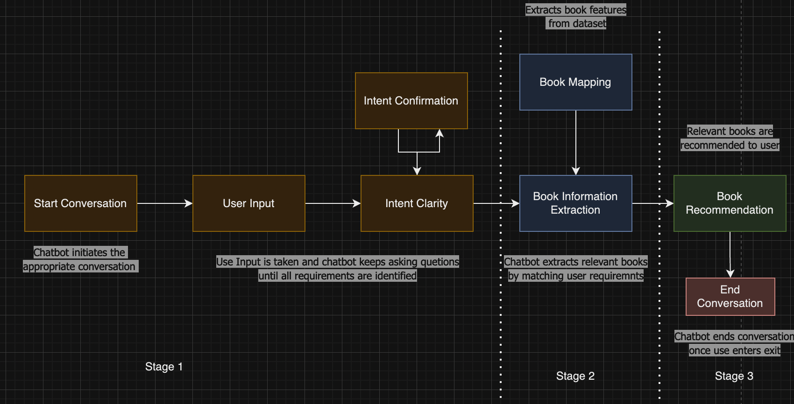

# BookRecommendation AI 
##### By Mahalakshmi Totad

## Part 1:  Project Goals
Book Recommendation Chatbot can be used to discover exciting books tailored to user preferences and interests. From different geners like thrilling mysteries, heartwarming romances, or thought-provoking non-fiction. **BookRecommendation AI, a chatbot that combines the power of large language models and rule-based functions to ensure relevant recommendations**.

#### Problem Statement

*Given a dataset containing information about books (book name, author,genre, rating , description), build a chatbot that parses the dataset and provides accurate book recommendations based on user's interest*.

#### Data Sources:

We have a dataset `goodreads_data.csv` where  each row describes the features of a single book and also has a small description and link at the end. The chatbot that we build will leverage LLMs to parse this `Genere` , `Author` and  `Description` column and provide recommendations

- Determine the user's interest. For simplicity, we have used below features to encapsulate the user's interest. The features are as follows:
    - Genres
    - Description (capture user specific interest within provided Genres)
    - Author (Optional)
    - Rating

- Confirm if the user's requirements have been correctly captured at the end.

After that the chatbot lists down the top 3 books that are the most relevant, and engages in further conversation to help the user find the best one.

## Part 2: System Design

#### Design Choices : Building the Chatbot

Now let's go ahead and understand the system design for the chatbot.

I'm leveraging the same system designed used earlier in classes for learning and building the chat bot in following stages:

|`Stage 1`

- Intent Clarity Layer
- Intent Confirmation Layer

`Stage 2`

- Book Mapping Layer
- Book Information Extraction Layer

`Stage 3`

- Book Recommendation Layer

##### Major functions behind the Chatbot

Let's now look at a brief overview of the major functions that form the chatbot. We'll take a deep dive later

- `initialize_conversation()`: This initializes the variable conversation with the system message.
- `get_chat_completions()`: This takes the ongoing conversation as the input and returns the response by the assistant
- `moderation_check()`: This checks if the user's or the assistant's message is inappropriate. If any of these is inappropriate, it ends the conversation.
- `intent_confirmation_layer()`: This function takes the assistant's response and evaluates if the chatbot has captured the user's interests and preferences clearly. Specifically, this checks if the following properties for the user has been captured or not  Author, Genere and short description containing interest and rating
- `dictionary_present()`: This function checks if the final understanding of user's interest is returned by the chatbot as a python dictionary or not. If there is a dictionary, it extracts the information as a Python dictionary.
- `compare_books_with_user()`: This function compares the user's interest with the different books and come back with the top 3 recommendations based on rating.
- `initialize_conv_reco()`: Initializes the recommendations conversation

## Part 3: Implementation

###  3.1- Implementing Intent Clarity and Intent Confirmation Layers

Let's start with the first part of the implementation - building the `intent clarity` and `intent confirmation` layers. As mentioned earlier, this layer helps in identifying the user requirements and passing it on to the book matching layer. Here are the functions that we would be using for building these layers:

### `initialize_conversation()`:
This initializes the variable conversation with the system message. Using prompt engineering and chain of thought reasoning, the function will enable the chatbot to keep asking questions until the user requirements have been captured in a dictionary. It also includes Few Shot Prompting(sample conversation between the user and assistant) to align the model about user and assistant responses at each step.

### `get_chat_completions()`:

This function perform LLM call using the Chat Completions API to get the LLM response.

### `moderation_check()`:
 This checks if the user's or the assistant's message is inappropriate. If any of these is inappropriate, you can add a break statement to end the conversation.
 
 ### `intent_confirmation_layer()`:

This function takes the assistant's response and evaluates if the chatbot has captured the user's profile clearly. Specifically, this checks if the following properties for the user has been captured or not
   - Genres
   - Author(optional)
   - Description
   - Rating
   
  ### 3.2 Implementing the Book Mapping and Information Extraction Layers
This stage consists of the steps that will extract information and form book features .

### `product_map_layer()`:

-  Use a prompt that assign it the role of a Book Specifications Classifier, whose objective is to extract key features and classify them based on book fields and features.

- Provide step-by-step instructions for extracting book features from description as well. This function is responsible for extracting key features and criteria from book features. 

- Since all the details of the books are already available in given columns and there is no logic is to be applied for the segregation of data we will use simple pandas commands to extact the required information and create books features column which will contin a dictionary with our keys and values

- Assign specific rules for each feature (e.g., Author, Description , Genres, Avg Rating) and associate them with the appropriate classification to extract the required information.

- Includes Few Shot Prompting (sample conversation between the user and assistant) to demonstrate the expected result of the feature extraction and classification process.

### `compare_books_with_user()`:

This function compares the user's profile with the different books and come back with the top recommendations. It will perform the following steps:
- It will take the user requirements dictionary as input
- Filter the books based on their rating, keeping only the ones within the user's rating perference.
- Calculate a score for each book based on how well it matches the user's requirements.
- Sort the books based on their scores in descending order.
- Return the top 3 books as a JSON-formatted string.

|Scoring Criterion:

- Genre : Score is incremented for every Genre match 
        - Eg: if user requirement is Classic and Fiction and the book feature has both then the score would be incremented by 2

- Author: Score is incremented by 1 if there is match on Author name as well

- Description : If the user desciption word/s are present in book feature description then score is incremented by only 1 for each hits. 

### `product_validation_layer()`:

This function verifies that the book recommendations are good enough, has score greater than 2, and matches the user's requirements.

### 3.3: Book Recommendation Layer

Finally, we come to the product recommendation layer. It takes the output from the `compare_books_with_user` function in the previous layer and provides the recommendations to the user. It has the following steps.
1. Initialize the conversation for recommendation.
2. Generate the recommendations and display in a presentable format.
3. Ask questions basis the recommendations.

### 3.4 Dialogue Management System

Bringing everything together, we create a `diagloue_mgmt_system()` function that contains the logic of how the different layers would interact with each other. This will be the function that we'll call to initiate the chatbot

### Challenges Faced

- In book mapping step extracting and storing features from 10k records from dataset was time consuming.
- Similarly in book extraction step matching user interest with each book feature was time comsuming
- These two steps consume lot of time and affect user interractions and overall experience. I have tried to solve this by using time out but there might be more elegant solutions out there

